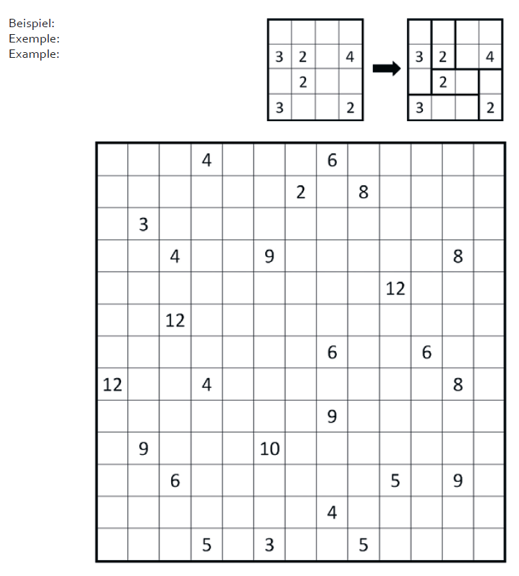

# EDD2018-2

##Description
Partagez la grille en rectangles et en carrés de sorte que chaque région contienne exactemeent un numéro.

Chaque numéro indique la taille du rectangle ou du carré correspondant.

##Sample

